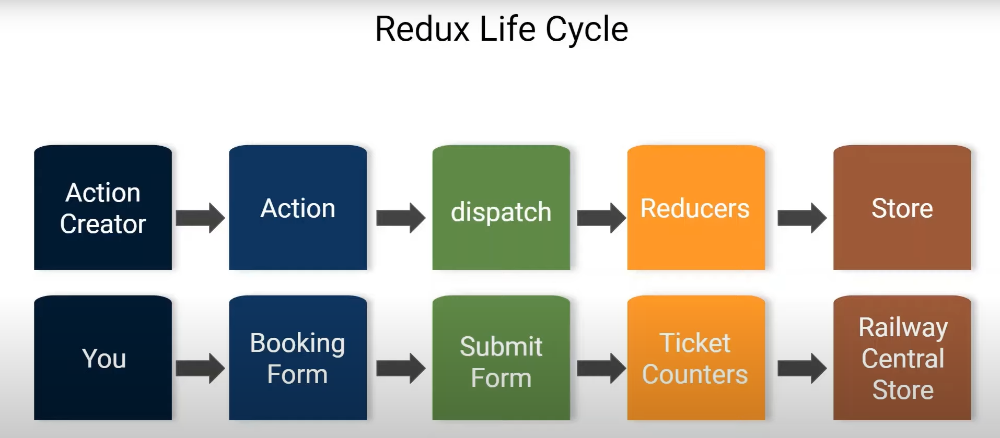

1.  A Movie Rating Application

2.  Topics: Redux, axios, folder-structure, carousel, movie-search, middle-ware

3.  #Steps: - delete unwanted files (reportWebVitals.js, setupTests.js, etc)
    
    
    

4.  Create Folders - - Common Folder - Components Folder - features Folder - Images Folder

5.  We are going to use a OMDB API. For that we need a key.

- [OMDB API](https://www.omdbapi.com/)

- OMDB API --> API key -->

- You can combine ( actions, reducers, store everything) in slice - redux-toolkit
